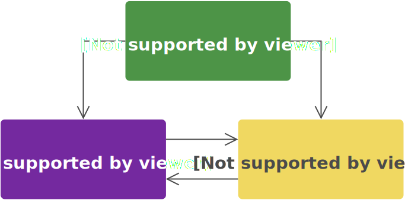
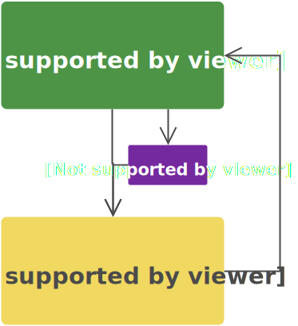
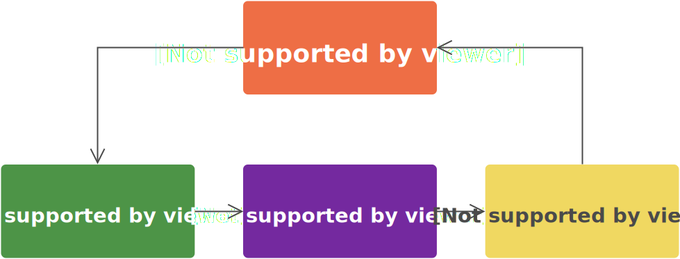
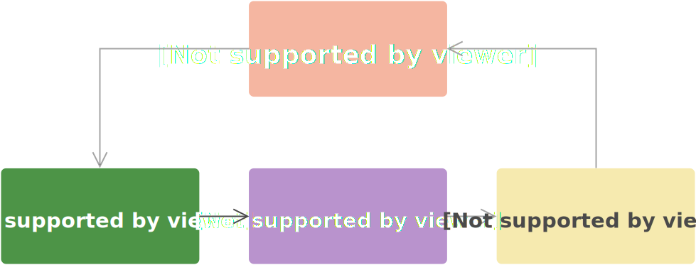
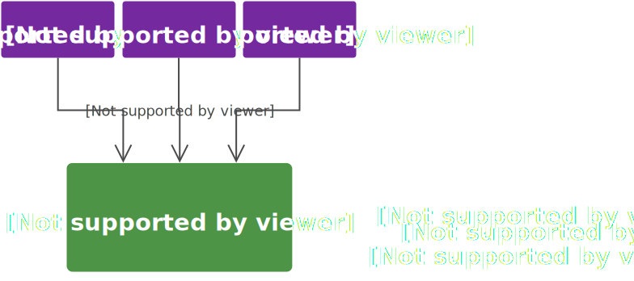
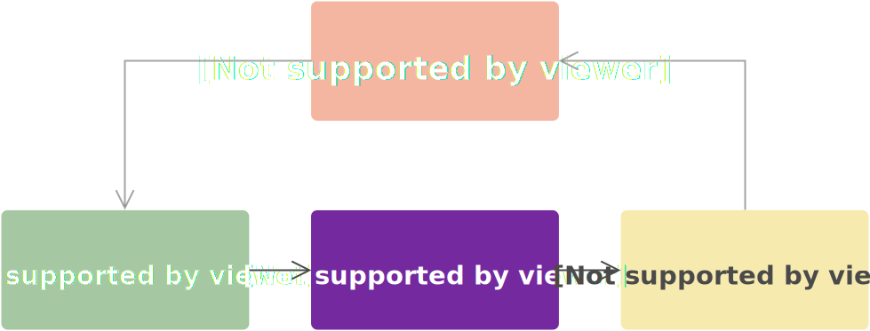

title: What the Flux
author: Robin Thrift
twitter: RobinThrift
homepage: RobinThrift.com
shortcodes: true
css:
    - 'http://fonts.googleapis.com/css?family=Droid+Sans:400,700|Source+Code+Pro|Kaushan+Script'
reveal:
    controls: true
    progress: true
    slideNumber: true
    history: true
    keyboard: true
    overview: true
    transition: 'linear'
    backgroundTransition: 'slide'

-- {
    background: 
        img: '#cb5243'
}

# [var title]

<div class="author-info">
    <h5>[var author]</h5>
    <h5>Jr. Dev, NewStore</h5>
    <a href="http://twitter.com/[var twitter]">@[var twitter]</a>
</div>

--

## What is Flux?

--

### What is Flux trying to solve?

--

### MVC



--

### MVC



-- {
    transition: 'slide-in none-out'
}


-- {
    transition: 'none-in slide-out'
}


--



--

## [colour hex=489541]The Dispatcher[/colour]


--

```typescript
interface Dispatcher {
    register(fn: (payload: Payload) => void): void;
    dispatch(payload: Payload): void;
}
```

```typescript
type Payload = {
    actionType: Symbol,
    data: any
}
```

-- {
    transition: 'slide-in none-out'
}



-- {
    transition: 'none-in slide-out'
}


-- 

## [colour hex=74299F]Stores[/colour]


-- {
    transition: 'slide-in none-out'
}

```typescript
interface Store {
    dispatch(payload: Payload): void;
}
```

-- {
    transition: 'none-in slide-out'
}

```typescript
interface Store<T> {
    public dispatch(payload: Payload): void;
    public registerView(fn: (oldState: T, newState: T) => void): void;
    private notifyViews(): void;
}
```
