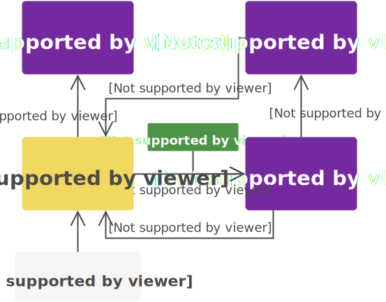

title: What the Flux
author: Robin Thrift
twitter: RobinThrift
homepage: RobinThrift.com
shortcodes: true
css:
    - 'http://fonts.googleapis.com/css?family=Droid+Sans:400,700|Source+Code+Pro|Kaushan+Script'
reveal:
    controls: true
    progress: true
    slideNumber: true
    history: true
    keyboard: true
    overview: true
    transition: 'linear'
    backgroundTransition: 'slide'
    showNotes: true
    dependencies:
        - src: 'scripts/plugins/notes.js'
          async: true

-- {
    background: 
        img: '#cb5243'
    notes: 'Or, a more important phylosophical question:'
}

# [var title]

<div class="author-info">
    <h5>[var author]</h5>
    <h5>Jr. Dev, NewStore</h5>
    <a href="http://twitter.com/[var twitter]">@[var twitter]</a>
</div>

--

## What is Flux?

--

### "Application Architecture for Building [emphasize]User Interfaces[/emphasize]"

--

### What is Flux trying to solve?

--

### MVC


--

### MVC


-- {
    transition: 'slide-in none-out'
}


-- {
    transition: 'none-in slide-out'
}




-- {
    transition: 'slide-in none-out'
}


-- {
    transition: fade
}


-- {
    transition: 'none-in slide-out'
}


--


--

## [colour hex=489541]The Dispatcher[/colour]


--

```typescript
interface Dispatcher {
    register(fn: (action: Action) => void): void;
    dispatch(action: Action): void;
}
```

```typescript
type Action = {
    actionType: Symbol,
    data: any
}
```

-- {
    transition: 'slide-in none-out'
}


-- {
    transition: 'none-in slide-out'
}


--  {
    notes: |
        - Stores many objects, not just one, like a model in MVC
        - single domain
}

## [colour hex=74299F]Stores[/colour]


-- {
    transition: 'slide-in none-out'
}

```typescript
interface Store {
    dispatch(action: Action): void;
}
```

-- {
    transition: 'none-in slide-out'
}

```typescript
interface Store<T> {
    public dispatch(action: Action): void;
    public registerView(fn: (oldState: T, newState: T) => void): void;
    private notifyViews(): void;
}
```

--

```typescript
class UserStore extends Store<User[]> {
    // ...
    dispatch(action: Action) {
        switch (action.actionType) {
            case 'ADD_USER':
                // ...
            break;
            case: 'UPDATE_USER':
                // ...
            break;
        }
    }
    // ...
}
```

[fragment]
```typescript
import dispatcher from './localDispatcher';
let userStore = new UserStore();
dispatcher.register(userStore.dispatch);
```
[/fragment]

-- {
    transition: 'slide-in none-out'
}

"[...] stores accept updates and reconcile them as appropriate [...]"

[fragment]
"[...] Stores have no direct setter methods [...], but instead have only a single way of getting new data into their self-contained world."
[/fragment]

<hr />

[small][https://facebook.github.io/flux/docs/overview.html](https://facebook.github.io/flux/docs/overview.html)[/small]

-- {
    transition: 'none-in slide-out'
}

"[...] stores accept updates and reconcile them as appropriate [...]"

"[...] Stores have no direct setter methods [...], but instead have only a single way of getting new data into their [emphasize]self-contained world[/emphasize]."

<hr />

[small][https://facebook.github.io/flux/docs/overview.html](https://facebook.github.io/flux/docs/overview.html)[/small]

--

### Stores in Veer


```typescript
class Store<T> {
    constructor(dispatcher) {
        // ...
        this.bindings = {
            // ...
        }
    }
    
    private setState(newState: T) {
        // ...
    }

    public subscribe(sub) {
        // ...
    }
}
```

--

### Veer store bindings

```typescript
this.bindings = {
    [CONSTANT]: this.someMethod.bind(this)
}

// in store class
set bindings(newBindings) {
    this._bindings = new Map(newBindings);
}


dispatch({actionType, data}) {
    if (this._bindings.has(actionType)) {
        this._bindings.get(actionType)(data);
    }
}
```

--

```javascript
import {Store} from 'veer/dist/store';
import {SubredditConstants} from '../constants/subreddits';

export class SubredditStore extends Store {
    constructor(dispatcher) {
        super(dispatcher);
        this.setState([]);
        this.bindings = {
            [SubredditConstants.GET_USER_SUBREDDITS]: 
                this.takeDataAsIs.bind(this)
        };
    }

    takeDataAsIs(data) {
        this.setState(data);
    }
}
```

--

## [colour hex=4A4A4A]Views[/colour]


--

<pre><code class="lang-typescript">render() {
    <span class="hljs-keyword">return</span> (
        &lt;input <span class="hljs-keyword">type</span>=<span class="hljs-string">"text"</span> 
               value={<span class="hljs-keyword">this</span>.state.value} 
               onChange={<span class="hljs-keyword">this</span>._handleChange.bind(<span class="hljs-keyword">this</span>)} /&gt;
        &lt;ul&gt;  
            {<span class="hljs-keyword">this</span>.state.suggestions.map((s) =&gt; {
                <span class="hljs-keyword">return</span> <span class="xml"><span class="hljs-tag">&lt;<span class="hljs-title">li</span>&gt;</span>{s}<span class="hljs-tag">&lt;/<span class="hljs-title">li</span>&gt;</span>;</span>
            })}
        &lt;/ul&gt;  
    );
}
</code></pre>

-- {
    notes: |
        - but, not quite the React way
}

```javascript
class AutoComplete extends React.Component {
    _handleChange(event) {
        let {value} = event.target;
        this.setState({value});
        autoCompleteActions.createListForValue(value);
    }
    onStoreUpdate(oldState, newState) {
        this.setState({suggestions: newState});
    }
    render() {
        // prev slide
    }
}
```

-- {
    notes: hands state down to children
}

```javascript
<ConnectToStores stores={[StoreA, StoreB]}>
    <AutoComplete />
</ConnectToStores>
```

--

#### Connection views and stores in Veer

```javascript
<ConnectToStores stores={{storeAState: storeAInstance}}>
    <OtherComponent />
</ConnectToStores>
```

`ConnectToStores` hands down the `stores` as idividual props and
handles the updates.

--

```javascript
import React, {Component} from 'react-native';
import {ConnectToStores} from 'veer/dist/components/connectToStores';
import {SubredditStore} from '../stores/subreddits';
import {SubredditList} from './SubredditList/index';

export class UserSubreddits extends Component {
    render() {
        let stores = {
            subreddits: SubredditStore.getDefaultInstance()
        };
        return (
            <ConnectToStores stores={stores}>
                <SubredditList {...this.props} />
            </ConnectToStores>
        );
    }
}
```

--


```javascript
export class SubredditList extends Component {
    // ...
    componentWillReceiveProps(nextProps) {
        // ...
    }
    // ...
}
```

-- {
    notes: |
        - Actions are central to flux
        - they propagate through the system
        - carrying interactions/data
        - are quite difficult
}

## [colour hex=EE6E45]Actions[/colour]


-- 

```typescript
type Action = {
    actionType: Symbol,
    data: any
}
```

-- {
    notes: But, if action in more than 1 view, this is tedious
}

```typescript
let myAction = {
    actionType: UPDATE_STUFF,
    data: 'Hello World'
};

dispatcher.dispatch(myAction);
```

-- {
    notes: |
        - Helper functions
        - wrap actions
}

### Action Creators
```typescript
function updateStuff(data) {
    dispatcher.dispatch({
        actionType: UPDATE_STUFF,
        data: data
    });
}

// ... somewhere down the line
updateStuff('Hello World');
```

-- {
    notes: |
        - type safety
        - usage of constants
}

### Action Types

```typescript
const types = {
    TYPE_A: Symbol(), // ES6/2015,
    TYPE_B: 'TYPE_B' // ES5
};

// TypeScript
enum types = {
    TYPE_A,
    TYPE B
};
```

-- {
    notes: |
        - strings are unsafe
}

### Constants

```
src/
├── dispatcher.js
├── actions/
├── constants/
│   └── todos.js
└── components/
```

[fragment]
```typescript
export const TODO_CONSTANTS = {
    ADD_TODO: Symbol(), // ES6/2015
    UPDATE_TODO: 'UPDATE_TODO' // ES5
};
```
[/fragment]

--

```typescript
import TODO_CONSTANTS from '../constants/todos';
function updateTodo(todo) {
    dispatcher.dispatch({
        actionType: TODO_CONSTANTS.UPDATE_TODO,
        data: todo
    });
}

// in a store
dispatch(action: Action) {
    switch (action.actionType) {
        case TODO_CONSTANTS.ADD_TODO: // ...
        break;
        case: TODO_CONSTANTS.UPDATE_TODO: // ...
        break;
    }
}
```

--

### Constants in Veer

```javascript
import constantCreator from 'veer/dist/constantCreator';
export const SubredditConstants = constantCreator([
    'GET_USER_SUBREDDITS',
    'GET_SUBREDDIT_LISTING'
]);
```

--

### Actions in Veer

```typescript
export const subredditActions = {
    getUserSubreddits() {
        // ...
        dispatcher.dispatch({
            actionType: SubredditConstants.GET_USER_SUBREDDITS,
            data: SOME_DATA
        });
    }
};
```

--

### Where to call actions?

```javascript
export class PostList extends Component {
    componentWillReceiveProps(nextProps) {
        this.setState({posts: nextProps.posts});
    }
    componentDidMount() {
        subredditActions
            .getSubredditListing(this.props.name, this.props.after);
    }
    onEndReached() {
        let last = this.state.posts.pop().id;
        subredditActions
            .getSubredditListing(this.props.name, last);
    }
    render() {
        return (
            <ListView
                onEndReached={this.onEndReached.bind(this)}
                ... />
        );
    }
```
